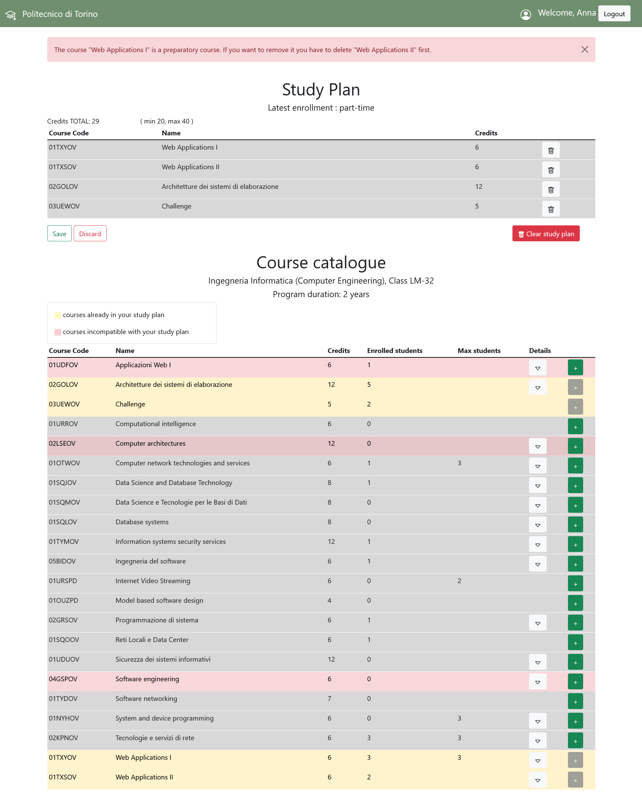

#  "Piano di studi"
This web application helps university students organize their course in their personal study plan. With this tool, you can easily view your study plan and make adjustments to the courses you're taking.
 

## React Client Application Routes

- Route `/`: shows list of courses when users are not logged in 
- Route `/login`: contains the login form
- Route `/loggedIn`: shows the study plan of logged in user followed by the list of courses
- Route `/edit`: shows the studyplan, the list of courses and others elements used to edit the study plan 
- Route `*`: manages all the other cases

## API Server


### __Login__

URL: `/api/sessions`

HTTP Method: POST
 
  Description: authenticate the user who is trying to login

Request body: credentials of the user who is trying to login

  ```
  {
      "username": "testuser@polito.it",
      "password": "password"
  }
  ```
Response: `200 OK` (success) `401` Unauthorized User (login failed), `422` Unprocessable Entity (values do not satisfy validators).


URL: `api/sessions/current`

HTTP Method: POST

 Description: check if the current user is logged in and get her data

Request body: None

  ```
    {
        "id": 2,
        "username": "test@studenti.polito", 
        "name": "Test"
    }
  ```


 Response: `200` OK (success)  `401` Unauthorized User (user is not logged in)

 Response body: authenticated user


URL: `api/sessions/current`

HTTP Method: DELETE

  Description: logout current user

Request body: None
  
Response: `200` OK (success) `401` Unauthorized User (user is not logged in)

Response body: None


### __List courses__

URL: `/api/courses`

HTTP Method: GET

Description: Get the list of courses

Request body: _None_

Response: `200 OK` (success) `500` (internal server error) `404` (not found)

Response body:

```
[{
"id": "02GOLOV",
"name": "Architetture dei sistemi di elaborazione",
"cfu": 12,
"maxstudents": ,
"incompatible": "02LSEOV",
"preparatory" : ,
"enrolled" : 1
},
...]

```

### __study plan__

URL: `/api/studyplan`

HTTP Method: GET

Description: Get the study plan

Request body: _None_

Response: `200 OK` (success) `500` (internal server error) `404` (not found)

Response body:

```
[{
"id": "02GOLOV",
"name": "Architetture dei sistemi di elaborazione",
"cfu": 12,
"maxstudents": ,
"incompatible": "02LSEOV",
"preparatory" : ,
"enrolled" : 1
}]

```

### __Add new study plan__

URL: `/api/edit`

HTTP Method: POST

Description: Adds the new study plan

Request body: 
```
[{
"id": "02GOLOV",
"name": "Architetture dei sistemi di elaborazione",
"cfu": 12,
"maxstudents": ,
"incompatible": "02LSEOV",
"preparatory" : ,
"enrolled" : 1
}, ...]

```


Response:`201 OK` (success) `503` (internal server error) `422` (not found)

Response body:_None_ 

 
### __Update students number__

URL: `/api/edit`

HTTP Method: PUT

Description: Update the number of enrolled students (decrement or increment) for each course of study plan

Request body: 
```
[{
"id": "02GOLOV",
"name": "Architetture dei sistemi di elaborazione",
"cfu": 12,
"maxstudents": ,
"incompatible": "02LSEOV",
"preparatory" : ,
"enrolled" : 1
}, ...],
{"sign" : 1}

```

Response:`201 OK` (success) `503` (internal server error) `422` (not found)

Response body:_None_ 

### __Delete study plan__

URL: `/api/edit`

HTTP Method: DELETE

Description: Delete the study plan

Request body: _None_

Response: `204` (success) `503` (internal server error)

Response body: _None_ 

### __Update enrollment__

URL: `/api/edit`

HTTP Method: PUT

Description: Update the type of student's enrollment

Request body: 
```
{"enrollment" : "part-time"}

```

Response:`201 OK` (success) `503` (internal server error) `422` (not found)

Response body:_None_ 

 

## Database Tables

- Table `users` - contains all info about users: id, email, password, enrollment, name, salt
- Table `pianostudi` - contains study pan courses for each student:  courseid, userid
- Table `corsi` - contains list of courses: id, name, cfu, maxstudents, incompatible, preparatory, enrolled

## Main React Components

- `MyNavbar` (in `NavbarComponent.js`): contains the button for login and logout and indicates the logged in user
- `CourseCatalogue` (in `HomePageComponent.js`): contains the list of all courses
- `StudyPlan` (in `HomeLoggedInComponent.js`): contains the study plan when user is logged in
- `HomePage` (in `HomePageComponent.js`) : contains CourseCatalogue component
- `HomePageLoggedIn` (in `HomeLoggedInComponent.js`) : containst StudyPlan and CourseCatalogue
- `LoginForm` (in `LoginComponents.js`) : is the component used to perform login

(only _main_ components, minor ones may be skipped)

## Screenshot



## Users Credentials

- student@studenti.polito, password  (part-time)
- test@studenti.polito, passwordT    (full-time)
- mario.rossi@studenti.polito, passwordM  (part-time)
- luigi.bianchi@studenti.polito, passwordL (part-time)
- anna.verdi@studenti.polito, passwordA
